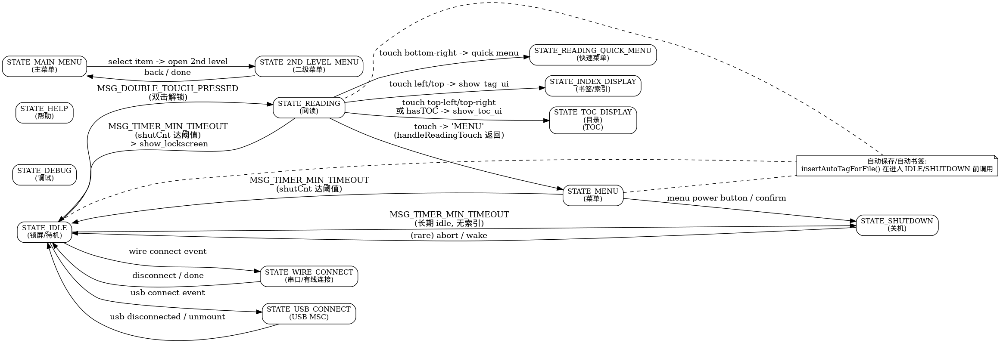

**总体架构概览**

- **目标**: 本项目为一款基于 ESP 系列芯片的电子墨水阅读器固件（ReadPaper），采用 FreeRTOS + M5Unified，模块化划分清晰，UI 与设备管理分离。
- **高层模块**:
  - 设备抽象层（device/）: 电源管理、文件系统、显示、USB、SD、内存池等。
  - 任务与状态机（src/tasks/）: 系统主状态机、各状态处理逻辑、后台索引、显示推送等。
  - 文本与渲染（text/）: 书籍解析、分页、字体渲染。
  - 配置与接口（config/, api/）: 配置管理与对外 HTTP/USB 接口。
  - 工具脚本（tools/）: 字体生成功能、表/表格生成与图片转换工具。

**状态机概览（重点）**

- 状态机以单一 FreeRTOS 任务承载：`StateMachineTask`（定义在 [src/tasks/state_machine_task.h](src/tasks/state_machine_task.h) 与实现 [src/tasks/state_machine_task.cpp](src/tasks/state_machine_task.cpp)）。
- 消息驱动：使用一个 `QueueHandle_t`（消息队列）接收 `SystemMessage_t`，队列长度在初始化时建立为 10 个消息。外部通过 `sendStateMachineMessage()` 或 `sendStateMachineMessage(const SystemMessage_t&)` 发送消息。
- 当前状态保存在静态变量 `currentState_` 中；任务主循环从队列读取消息后通过 `switch(currentState_)` 分派到对应的状态处理函数（各状态处理实现于 `src/tasks/state_*.cpp`）。

**状态枚举与含义**

定义在 `StateMachineTask` 头文件中（[src/tasks/state_machine_task.h](src/tasks/state_machine_task.h)）:

- `STATE_IDLE`：锁屏/待机界面，等待双击或外部事件唤醒。
- `STATE_DEBUG`：进入调试界面（可选启动模式）。
- `STATE_READING`：阅读主流程，处理翻页、自动翻页、触摸事件。
- `STATE_READING_QUICK_MENU`：阅读时的快速菜单。
- `STATE_HELP`：帮助界面。
- `STATE_INDEX_DISPLAY`：索引/书签列表显示。
- `STATE_TOC_DISPLAY`：目录（TOC）显示。
- `STATE_MENU`：通用菜单。
- `STATE_MAIN_MENU`：主菜单。
- `STATE_2ND_LEVEL_MENU`：主菜单的二级菜单。
- `STATE_WIRE_CONNECT`：通过无线连接的交互模式(WIRE这个纯粹是早期没写对，后来懒得改了)。
- `STATE_USB_CONNECT`：USB 连接（MSC）模式。
- `STATE_SHUTDOWN`：关机流程。

**消息类型（触发器）**

定义为 `MessageType_t`：
- `MSG_TIMER_MIN_TIMEOUT`：每分钟触发一次（用于长超时/关机计数、内存监控）。
- `MSG_TIMER_5S_TIMEOUT`：短周期定时（在阅读状态有细化为每秒触发的计时器，用于自动翻页逻辑）。
- `MSG_USER_ACTIVITY`：通用用户活动，更新 lastActivityTime_。
- `MSG_TOUCH_PRESSED` / `MSG_TOUCH_RELEASED` / `MSG_TOUCH_EVENT`：触摸输入，驱动翻页、菜单切换、书签等。
- `MSG_DOUBLE_TOUCH_PRESSED`：双击（常用于解锁，从 `STATE_IDLE` 到 `STATE_READING`）。
- `MSG_BATTERY_STATUS_CHANGED` / `MSG_CHARGING_STATUS_CHANGED` / `MSG_POWER_EVENT`：电源/电池相关事件。
- `MSG_DEVICE_ORIENTATION`：设备朝向变化，可能触发显示旋转。

消息承载结构为 `SystemMessage_t`，包含 `type`, `timestamp` 和按消息类型区分的 `data` 联合体（触摸坐标、电池信息、方向等）。

**状态机实现细节**

- 初始化：`StateMachineTask::initialize()` 创建消息队列与 FreeRTOS 任务，设置初始状态（默认 `STATE_IDLE`，可通过 `enterDebug` 强制 `STATE_DEBUG`）。
- 任务主循环：`taskFunction` 永久循环，阻塞等待队列消息（`xQueueReceive`），取到消息后根据 `currentState_` 调用对应的 `handle*State()`。
- 状态处理分散：每个状态的处理函数实现为 `static` 方法并分散在 `src/tasks/state_*.cpp`，例如：
  - `STATE_READING` -> `src/tasks/state_reading.cpp`
  - `STATE_IDLE` -> `src/tasks/state_idle.cpp`
  - `STATE_MENU` -> `src/tasks/state_menu.cpp`
  - `STATE_SHUTDOWN` -> `src/tasks/state_shutdown.cpp`
  - 其它 `state_*.cpp` 文件见 `src/tasks/` 目录。
- 状态切换：由状态处理函数内部设置 `currentState_ = STATE_XXX;` 来改变下一个消息处理分支（切换是同步的，发生在处理当前消息期间）。

**典型转换与触发点（示例）**

- 从 `STATE_IDLE` 到 `STATE_READING`：收到 `MSG_DOUBLE_TOUCH_PRESSED`（双击解锁），若 `g_current_book` 有效则渲染当前页面并进入阅读。
- 从 `STATE_READING` 到 `STATE_MENU`：触摸翻页返回值携带 `"MENU"` 消息时切换到菜单并显示阅读菜单。
- 从 `STATE_READING` 到 `STATE_TOC_DISPLAY` / `STATE_INDEX_DISPLAY`：触摸特定角落或 UI 元素（例如页面右上角/左上角）触发目录或书签显示。
- 从若干状态到 `STATE_IDLE` 或 `STATE_SHUTDOWN`：由 `MSG_TIMER_MIN_TIMEOUT` 计数（`shutCnt`）驱动，超过阈值后进入锁屏或关机（实现见 `state_idle.cpp`、`state_menu.cpp`、`state_reading.cpp`）。

**计时器与自动功能**

- 自动翻页：在 `STATE_READING` 中，`MSG_TIMER_5S_TIMEOUT`（代码注释表明该定时器每秒触发）用于按 `g_config.autospeed` 计算阈值并在达到时调用 `g_current_book->nextPage()`。
- 自动保存（自动书签/标签）：在进入 IDLE/SHUTDOWN 前会调用 `insertAutoTagForFile()` 保存当前页位置（见多个状态处理实现）。

**并发与同步注意事项**

- 状态机为单任务串行处理消息，避免了跨状态并发竞态。外部模块通过消息队列异步通知状态机。
- 队列深度（10）可能在高并发事件时导致消息丢失（`sendStateMachineMessage` 会打印错误），必要时可增大队列长度或改用优先级队列。

**关键文件（快速定位）**

- `src/tasks/state_machine_task.h` / `src/tasks/state_machine_task.cpp`
- `src/tasks/state_reading.cpp`
- `src/tasks/state_idle.cpp`
- `src/tasks/state_menu.cpp`
- `src/tasks/state_shutdown.cpp`
- 其它状态文件：`src/tasks/state_*.cpp`（例如 `state_main_menu.cpp`, `state_usb_connect.cpp` 等）

**结论**

状态机为本项目的核心调度与 UI 驱动枢纽，采用消息队列 + 单一任务的简单明确架构。各状态实现分文件维护，便于扩展与维护；建议对关键路径（定时器、USB/索引）添加更详尽的文档或流程图。

